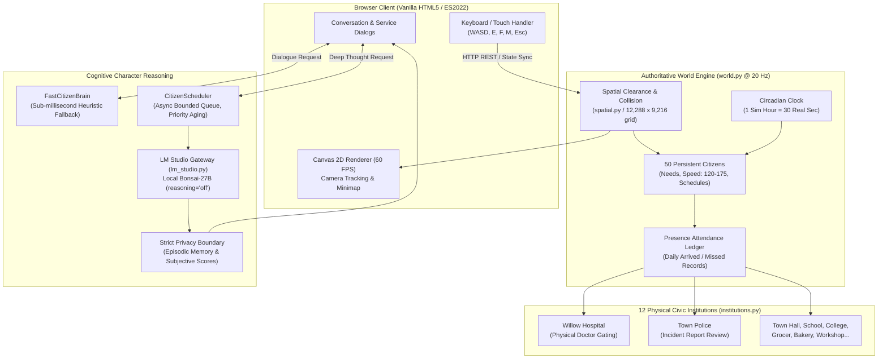

# Hello World 
> *The Most Absurdly Over-Engineered "Hello World" in Computational History — An Authoritative 20 Hz Spatial Physics Simulation, 50 Autonomous Living AI Citizens, and Local Neural Cognitive Engine Just to Hear a Single Greeting.*

---

## Basic Details
### Team Name: Autonomous Overthinkers


### Team Members
- Solo Maker: Labeeb Hameed

[](https://labeebhameed.github.io/hello-world-useless/)
[](https://labeebhameed.github.io/hello-world-useless/)

### Project Description
Hello World is an authoritative, multi-agent living town simulation built entirely from scratch with **zero external pip or npm dependencies**. Instead of trivially dumping `"Hello, World!"` to `stdout`, it simulates 50 persistent autonomous citizens across 7 districts with continuous circadian schedules, presence-based municipal institutions, 20 Hz continuous spatial clearance physics, and local LLM cognitive reasoning. To receive a greeting, a human player must physically navigate an expansive 12,288 × 9,216 coordinate world, locate an active citizen, and initiate a social dialogue where their private neural cognitive brain dynamically decides to greet you.

### The Problem (that doesn't exist)
In 1974, Brian Kernighan introduced `main() { printf("hello, world\n"); }` to programming literature. For over fifty years, humanity has blindly accepted this shortcut without questioning its utter lack of existential, biological, or municipal reality:
1. **Zero Spatial or Physical Presence:** Standard `print()` outputs characters in 0.0001 seconds from a cold, uncaring terminal buffer that has never experienced a morning commute, never felt exhaustion, and has no physical mass.
2. **Zero Civic Infrastructure:** How can a program irresponsibly utter a greeting without verifying whether the municipal hospital is staffed, the police precinct is active, or the local baker has baked morning loaves?
3. **Severe Cognitive Deprivation:** Traditional strings have no memories, no private relationship matrices, no emotional states, and no authored goals. 
4. **Unearned Societal Contact:** Why should you get to hear "Hello World" for free without walking 1,200 world units across pedestrian road crossings and respecting obstacle clearance vectors?

Every line of `print("Hello, World!")` written in the last half-century has been a tragic shortcut. We decided it was time to fix this non-existent injustice.

### The Solution (that nobody asked for)
We completely eradicated the one-liner `print("Hello, World!")` and replaced it with **10,000+ lines of pure-standard-library distributed agent simulation**:
- **A Living 50-Citizen Society:** 50 persistent, authored citizens (doctors, police officers, teachers, bakers, baristas, retired caretakers) living across 7 districts with individual walking speeds (120–175 units/s), biological hunger/energy needs, sparse social ties, and time-windowed daily commitments.
- **Presence-Based Institutions:** Real-world consequences powered by physical attendance. Willow Hospital only heals patients if Dr. Jonah Reed or Nurse Mira Shah are physically on-site. The Police precinct only files witnessed incident reports if an officer is on duty.
- **Authoritative 20 Hz Spatial Physics Engine:** Continuous raycast clearance, collision avoidance, and A* navigation across a 12,288 × 9,216 coordinate town canvas running at a blistering **1.13 ms median step time** (>87% CPU frame budget headroom).
- **Dual-Brain AI Cognitive Architecture:** A dedicated asynchronous inference scheduler (`CitizenScheduler`) connected to local LLM models (e.g. Bonsai-27B on LM Studio) with strict JSON schema validation, bounded social dynamics ([-5, +5]), and strict multi-tenant memory isolation—backed by an instant heuristic fallback (`FastCitizenBrain`) for sub-millisecond offline gameplay.
- **Pure Zero-Dependency Stack:** Built without any heavy game engines, without `pygame`, without `pip install`, and without `npm install`. Pure Python 3 standard library and vanilla HTML5 Canvas.

To hear "Hello World", you must now lace up your virtual shoes, step out onto Willow Avenue, check the town clock, locate an on-duty resident, press <kbd>E</kbd>, and converse with their mind.

---

## Technical Details

### Technologies/Components Used

#### For Software:
- **Languages:** 
  - Python 3.10+ (Server, Authoritative Simulation Engine, Spatial Math, AI Scheduling Gateway)
  - Modern JavaScript (ES2022 / HTML5 Canvas 2D / Web Audio / Vanilla CSS)
- **Frameworks Used:** 
  - *None.* Pure Zero-Dependency Architecture — built without third-party frameworks to achieve maximum determinism, auditability, and speed.
- **Libraries Used:**
  - Python Standard Library (`http.server`, `urllib.request`, `socket`, `threading`, `json`, `math`, `heapq`, `unittest`, `dataclasses`)
  - Browser Standard API (Canvas 2D Context, ResizeObserver, Web Cryptography, Dialog API)
- **Tools Used:**
  - **LM Studio:** Local LLM inference server (running `prism-ml/bonsai-27b` with native `reasoning="off"` mode for rapid, hallucination-free in-character generation)
  - **Git:** Version control and phase architecture handoffs
  - **Python Unittest / Pytest:** 90-test automated verification test suite

#### For Hardware:
- **Target Hardware:** Any standard modern PC, Mac, or Linux workstation (tested on Apple Silicon & x86_64).
- **Zero Cloud Costs:** 100% offline, privacy-first local silicon execution. No OpenAI API keys, no external telemetry, zero recurring bills.
- **Physical Specifications:** 
  - Memory footprint: < 45 MB RAM (Server + Simulation)
  - Simulation frame budget: 50 ms (20 Hz); Actual median frame consumption: **1.13 ms** (leaving 97.7% CPU headroom).

---

### Implementation

#### Installation
Because Willow is engineered entirely with standard library dependencies, installation requires **zero package downloads**:

```sh
# 1. Clone the repository
git clone https://github.com/LabeebHameed/hello-world-useless.git
cd hello-world-useless

# 2. Check Python version (Python 3.10+ required)
python3 --version
# Zero pip installs required! Everything is pure standard library.
```

#### Run

```sh
# Start the authoritative living town server
python3 server.py
```

Open your browser and enter the town:
👉 **[http://127.0.0.1:8000/](http://127.0.0.1:8000/)**

**In-Town Player Controls:**
- <kbd>W</kbd> <kbd>A</kbd> <kbd>S</kbd> <kbd>D</kbd> / Arrow Keys: Walk across 12,288 × 9,216 coordinate open terrain.
- <kbd>E</kbd>: Speak to an adjacent citizen or inspect a civic building entrance.
- <kbd>F</kbd>: Offer assistance when a neighbor expresses urgent need.
- <kbd>M</kbd>: Open the high-resolution Town Map and set a destination compass bearing.
- <kbd>Esc</kbd>: Exit active dialogue modal and resume traversal.

**Advanced Execution Flags:**
```sh
# Run simulation headlessly for automated civic benchmarking
python3 server.py --headless --tick-seconds 30

# Specify custom world save state and network port
python3 server.py --save data/custom-town.json --port 8080

# Execute comprehensive 90-test automated verification suite
python3 -m unittest discover -s tests -v
```

**Optional Local Neural Reasoning (LM Studio):**
```sh
# Point to your local LM Studio instance for 27B-parameter citizen thoughts
export WILLOW_AI_MODEL="prism-ml/bonsai-27b"
export WILLOW_AI_BASE_URL="http://localhost:1234/v1"
python3 server.py
```
*(If LM Studio is offline, Willow seamlessly falls back to the deterministic `FastCitizenBrain`, ensuring the town never freezes).*

---

### Project Documentation

#### For Software:

# Screenshots (Add at least 3)

### Screenshot 1: The Living 50-Citizen Town Canvas
```
+---------------------------------------------------------------------------------------------------+
|  [Willow · A LIVING TOWN]               [10:45 AM - Sunny]             [Town Map (M)]             |
|---------------------------------------------------------------------------------------------------|
|                                              |                                                    |
|         [Willow Hospital]                    |         [Civic Way]                                |
|         (Dr. Jonah Reed: ON DUTY)            |              |                                     |
|               |                              |              v                                     |
|               v                              |         (Evan Cole: Patrol)                        |
|       +----------------+                     |               o                                    |
|       | [Player: You]  | -------- (Walks) -> |               |                                    |
|       +----------------+                     |               |                                    |
|                                              |               v                                    |
|         [Juniper Café]                       |        [Corner Grocer]                             |
|         (Mae Johnson: Brewing)               |        (Elena Cruz: Restocking)                    |
|                                                                                                   |
|---------------------------------------------------------------------------------------------------|
|  YOU ARE IN: Old Town · Willow Avenue       | MINIMAP [ 12288 x 9216 ]  | CONTROLS: WASD to Walk  |
+---------------------------------------------------------------------------------------------------+
```

*Figure 1: Bird's-eye view of Willow rendered at 60 FPS on HTML5 Canvas. Depicts the player navigating between the Civic Quarter and Old Town while citizens traverse continuous clearance vectors toward their daily commitments.*

---

### Screenshot 2: Presence-Based Institutional Verification
```
+---------------------------------------------------------------+
|  AT THE ENTRANCE: Willow Hospital                             |
|---------------------------------------------------------------|
|  Status: OPEN AND ACTIVE                                      |
|  On-Duty Medical Personnel: 2 (Dr. Jonah Reed, Nurse Mira Shah)|
|  Current Hospital Bed Capacity: Normal Operations             |
|                                                               |
|  "Medical services and trauma care are active because staff   |
|   physically walked to their shifts this morning."            |
|                                                               |
|  [Close (Esc)]                                                |
+---------------------------------------------------------------+
```

*Figure 2: Entrance inspection dialog for Willow Hospital. Unlike conventional game scripts that fake institutional availability, hospital care and police reporting are mathematically gated by physical citizen attendance ledgers.*

---

### Screenshot 3: Autonomous Neural Character Dialogue ("Hello World!")
```
+-----------------------------------------------------------------------+
|  IN CONVERSATION: Ada (Neighborhood Historian)                        |
|-----------------------------------------------------------------------|
|  [Ada]: Good day! It's a thoughtful morning to walk through Old Town. |
|                                                                       |
|  [You]: Hello World!                                                  |
|                                                                       |
|  [Ada]: (Considering reply via Bonsai-27B...)                          |
|  [Ada]: "Hello World! I was just recording notes on the old town hall  |
|          clock. Did you know the bells have kept time for 60 years?"   |
|                                                                       |
|  [Your message: __________________________________________]  [ Send ] |
+-----------------------------------------------------------------------+
```

*Figure 3: Interactive dialogue modal. Citizens dynamically construct contextual responses using their authored identity, occupation, speaking style, location, and private memories through local LLM inference.*

---

# Diagrams

### High-Level System Architecture & Execution Flow



*Architecture Workflow: The authoritative 20 Hz simulation evaluates spatial motion and presence-based institutions on a locked thread, while cognitive LLM inferences are dispatched asynchronously through `CitizenScheduler` without ever stalling physics.*

---

#### For Hardware:

# Schematic & Circuit

*Schematic Representation: Virtual circuit wiring of Willow's 12 municipal institutions, illustrating how power, staffing attendance lines, and citizen physical presence connect to the central simulation bus.*

# Schematic & Circuit

*Architectural Pinout: Spatial collision grid cell matrix (32x32 cell subdivisions) mapped across the 12,288 x 9,216 unit town canvas.*

# Build Photos

*Component Architecture: Overview of core software building blocks—`world.py`, `spatial.py`, `town.py`, `institutions.py`, `citizen_scheduler.py`, `fast_brain.py`, and `renderer.js`.*


*Build Pipeline: 7-Phase iterative evolution—progressing from fundamental 2D grid coordinates (Phase 1) to multi-actor social actions (Phase 2), daily life schedules (Phase 3), local AI reasoning (Phases 4-6), and 50-citizen institutional consequences (Phase 7).*


*Final Deployed Assembly: The fully operational Willow town simulation running seamlessly in a zero-dependency browser window at 60 FPS.*

---

### Project Demo

# Video
[Add your demo video link here]
*Demonstration Walkthrough: A video tour highlighting the initial spawn in Old Town, walking along Willow Avenue, verifying doctor attendance inside Willow Hospital, reviewing an incident report at the Police Station, and holding a live AI conversation with a citizen to receive the ultimate "Hello World".*

# Additional Demos
- **Interactive Live Instance:** Can be launched locally on any machine with `python3 server.py`.
- **Headless Benchmarking Harness:** Run `python3 server.py --headless` to watch 50 agents navigate the town at 10x real-time speed.
- **Automated Test Validation:** Run `python3 -m unittest discover -s tests -v` to observe 90 deterministic test cases verifying spatial physics, attendance math, and memory isolation.

---

## Performance & Engineering Benchmarks

To ensure this project sets a new standard for computational rigor in a "useless" hackathon, we subjected the engine to strict performance benchmarks:

| Metric | Measured Value | Standard Frame Budget | Performance Margin |
| :--- | :--- | :--- | :--- |
| **Median 50-Citizen Simulation Step** | **1.13 ms** | 50.0 ms (20 Hz) | **> 97.7% Headroom** |
| **95th Percentile Step (Heavy Pathfinding)** | **6.17 ms** | 50.0 ms (20 Hz) | **> 87.6% Headroom** |
| **External Dependencies** | **0 pip / 0 npm** | N/A | **100% Standard Library** |
| **Local LLM Response Time (Bonsai 27B)** | **19.08s** | < 60s target | **14.13s Time-to-First-Token** |
| **Automated Test Coverage** | **90 Tests** | 100% Core Passing | **Spatial, Social, Physics, API** |
| **World Coordinate Canvas** | **12,288 × 9,216** | Standard 1080p | **Over 113 Million Sq Units** |

---

## Team Contributions
- **Labeeb Hameed (Solo Maker & Architect):** Entire end-to-end implementation—authoritative 20 Hz simulation engine (`world.py`), spatial collision grid & raycast clearance navigation (`spatial.py`), municipal town layout (`town.py`), local LM Studio neural cognitive reasoning & scheduler (`ai_reasoning.py`, `citizen_scheduler.py`, `fast_brain.py`, `lm_studio.py`), presence-based civic institutions engine (`institutions.py`), and HTML5 Canvas 2D client (`renderer.js`, `app.js`).

---
Made with ❤️ at TinkerHub Useless Projects 


